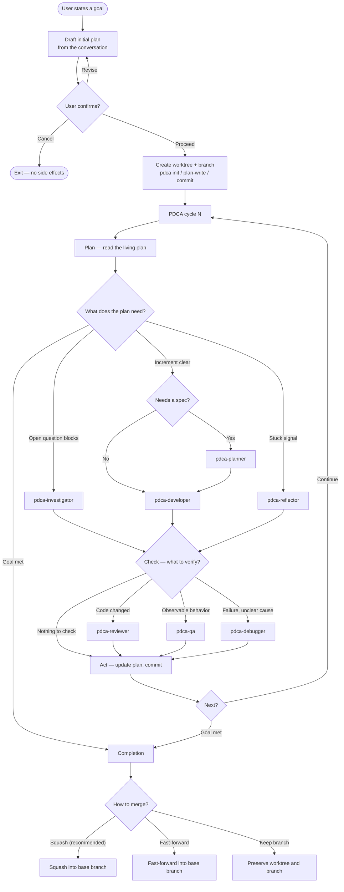

# PDCA Agent Orchestrator

A multi-agent development workflow for [opencode](https://opencode.ai) that drives a goal
to completion through repeated **Plan → Do → Check → Act** cycles against a *living plan*.

A single primary agent — the **orchestrator** — coordinates seven specialized subagents.
The orchestrator never writes code or runs tests itself; it routes work to the right agent,
records what was learned each cycle, and keeps the plan up to date. All plan and history
state flows through one tool, `pdca`, so the on-disk layout is an implementation detail the
agents never touch directly.

- Each goal gets its own git **branch + worktree**; every cycle is committed there, so the
  base branch stays clean until you choose to merge.
- A **living plan** accumulates known facts, open questions, decisions, and increments
  across cycles — the system gets smarter about the goal as it iterates.
- Stuck loops are detected automatically and routed to a read-only **reflector** before
  escalating to you.

## Agents

| Agent | Mode | Edits code? | Role |
|---|---|---|---|
| `pdca-orchestrator` | primary | no | Runs the whole workflow: drafts the plan with you, creates the worktree, drives the PDCA loop, commits each cycle, offers to merge. |
| `pdca-investigator` | subagent | no (read-only) | Answers **one** scoped Open Question using read-only code search; cites files and lines. |
| `pdca-planner` | subagent | no (read-only) | Turns the next step into a single increment spec: hypothesis, scope, acceptance criteria. Does not design the whole feature. |
| `pdca-developer` | subagent | **yes** | Implements exactly **one** increment per spec, verifies the build/tests, reports changes and any plan gaps. Does not commit. |
| `pdca-reviewer` | subagent | no (read-only) | Reviews the developer's diff for quality, scope adherence, and plan consistency. Separates code issues from plan issues. |
| `pdca-qa` | subagent | no (read-only) | Verifies the increment against its acceptance criteria, runs tests, reports observed vs. expected. |
| `pdca-debugger` | subagent | no (read-only) | Root-causes an unexpected failure from a failing entry. Diagnoses only — never applies a fix. |
| `pdca-reflector` | subagent | no (read-only) | Dispatched when the loop is stuck. Re-reads the plan and recent cycles, tags facts as measured vs. inferred, and proposes alternative framings and the highest-leverage next question. |

The orchestrator is `mode: primary` (you interact with it directly). The other seven are
`mode: subagent` — the orchestrator dispatches them with the `Task` tool, one at a time,
and reads each one's written entry before proceeding.

## Workflow graph



### Which agent, when

| Situation | Phase | Agent dispatched |
|---|---|---|
| An Open Question blocks progress | Plan / Do | `pdca-investigator` |
| Next increment is clear but needs a spec | Plan / Do | `pdca-planner` → `pdca-developer` |
| Next increment is obvious | Plan / Do | `pdca-developer` (inline spec) |
| A stuck signal fires | Plan / Do | `pdca-reflector` (read-only cycle) |
| Code changed and needs review | Check | `pdca-reviewer` |
| Observable behavior to verify | Check | `pdca-qa` |
| Unexpected failure, unclear root cause | Check | `pdca-debugger` |
| Goal met, no blocking questions | — | Completion (no agent) |

**Stuck signals** (any one forces a Reflect cycle before more Do cycles): 3 consecutive
cycles on the same question with no object-level progress; a new Decision added in 3 of the
last 5 cycles; certainty-then-revert language repeating across cycles; or a fix added and
reverted in 2 of the last 5 cycles. The orchestrator reflects before it escalates to you.

## Starting the orchestrator

The workflow runs inside opencode.

1. **Launch opencode** in the repository where the work should happen.
2. **Switch to the `pdca-orchestrator` agent** — press `Tab` to cycle agents until it's active.
3. **State your goal** in plain language, e.g.:
   > make the login form show a validation error when the email field is empty

   If you've already discussed the task in the session, the orchestrator distills that
   conversation (goal, known facts, decisions, open questions) into the seed plan.
4. **Confirm the plan.** The orchestrator drafts a living plan and asks you to
   **Proceed / Revise / Cancel**. Revise freely — steps run in-session and nothing touches
   git until you choose Proceed.
5. **On Proceed**, it creates a `{goal-name}` branch + worktree, writes the plan, and enters
   the PDCA loop. It returns to you only at **completion**, asking how to merge
   (squash / fast-forward / keep the branch).

You can course-correct at any time — the orchestrator also asks you via a prompt before
adjusting scope (it never silently drops or shrinks a planned feature).

## Repository layout

```
opencode/
├── agents/
│   ├── pdca-orchestrator.md     # primary — runs the loop
│   ├── pdca-investigator.md     # subagent — answers one open question
│   ├── pdca-planner.md          # subagent — specs one increment
│   ├── pdca-developer.md        # subagent — implements one increment
│   ├── pdca-reviewer.md         # subagent — reviews the diff
│   ├── pdca-qa.md               # subagent — verifies acceptance criteria
│   ├── pdca-debugger.md         # subagent — root-causes a failure
│   └── pdca-reflector.md        # subagent — reframes when stuck
└── tools/
    └── pdca.ts                  # the `pdca` tool: living-plan + history I/O
```

All plan and cycle state is read and written through the `pdca` tool (`plan-read`,
`plan-write`, `complete`, and the `entry-*` / `list` / `template` commands) — the agents
never reference or hand-edit the underlying files.
